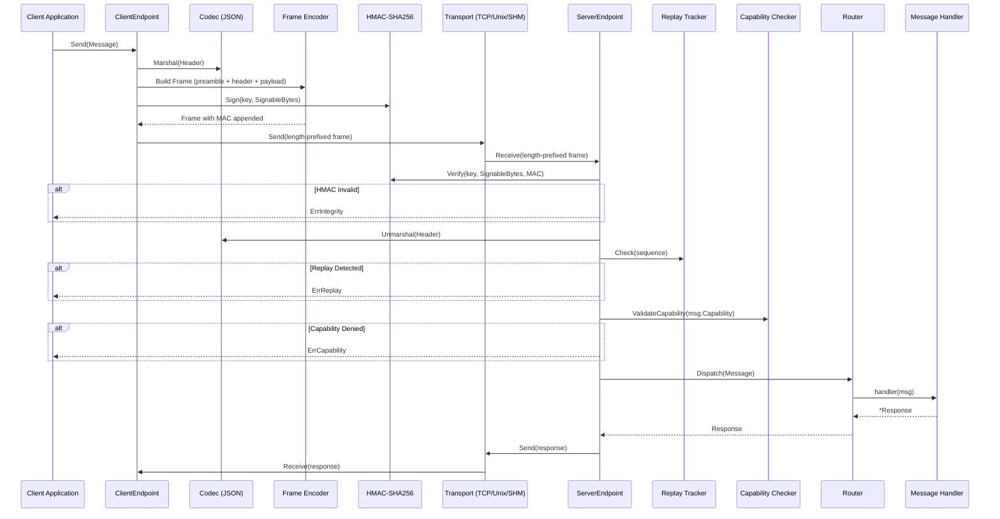
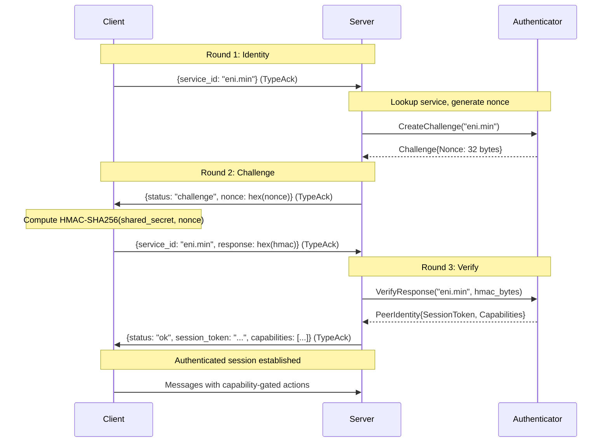
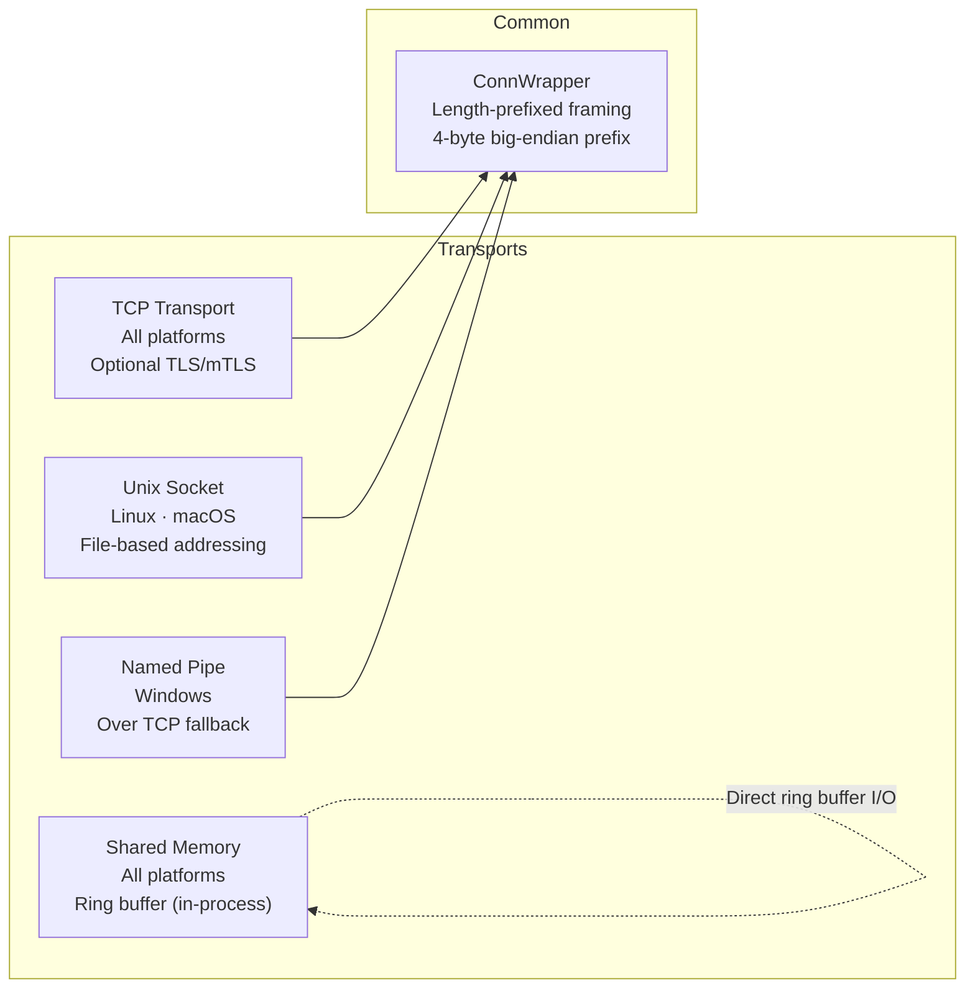
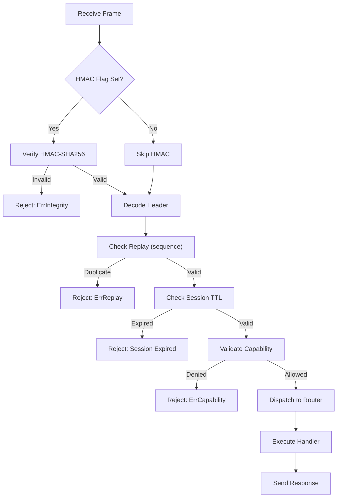
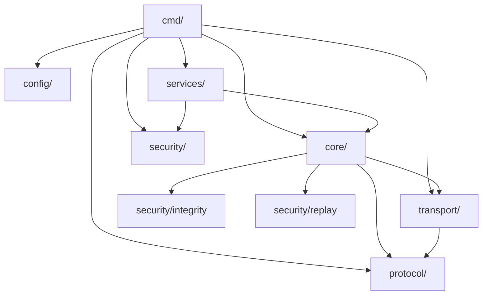

# EIPC Architecture

## Overview

EIPC (Embedded Inter-Process Communication) is a layered, security-enhanced IPC framework designed for communication between ENI (Neural Interface) and EAI (AI Layer) in the EoS ecosystem. It features pluggable transports, a binary wire protocol, priority-aware message routing, and a comprehensive security pipeline.

---

## Component Architecture

```mermaid
graph TB
    subgraph Application["Application Layer"]
        CMD["cmd/<br/>eipc-server · eipc-client · eipc-cli"]
    end

    subgraph Services["Services Layer"]
        BRK["Broker<br/>pub/sub routing"]
        REG["Registry<br/>service discovery"]
        POL["Policy Engine<br/>3-tier authorization"]
        AUD["Audit Logger<br/>JSON-line tracing"]
        HLT["Health Monitor<br/>heartbeat tracking"]
    end

    subgraph Core["Core Layer"]
        MSG["Message<br/>canonical envelope"]
        EP["Endpoint<br/>Client · Server"]
        RTR["Router<br/>priority-lane dispatch"]
        EVT["Events<br/>Intent · Chat · Tool · Ack"]
    end

    subgraph Security["Security Layer"]
        AUTH["Authenticator<br/>challenge-response"]
        CAP["Capability Checker<br/>action allowlists"]
        HMAC["HMAC Integrity<br/>SHA-256 signing"]
        AES["AES-GCM Encryption<br/>payload confidentiality"]
        RPL["Replay Tracker<br/>sliding window"]
        KR["Keyring<br/>key lifecycle"]
    end

    subgraph Protocol["Protocol Layer"]
        FRM["Frame<br/>binary wire format"]
        HDR["Header<br/>routing metadata"]
        CDC["Codec<br/>JSON · Protobuf · CBOR"]
    end

    subgraph Transport["Transport Layer"]
        TCP["TCP<br/>+ optional TLS/mTLS"]
        UNX["Unix Socket<br/>Linux · macOS"]
        WIN["Named Pipe<br/>Windows"]
        SHM["Shared Memory<br/>ring buffer"]
    end

    CMD --> Services
    CMD --> Core
    Services --> Core
    Core --> Security
    Core --> Protocol
    Protocol --> Transport
    Security --> Protocol
```



---

## Message Flow

The following diagram shows the complete lifecycle of a message from client to server:



---

## Authentication Handshake

EIPC uses a 3-round challenge-response protocol for peer authentication:



---

## Wire Protocol Format

```text
 0                   1                   2                   3
 0 1 2 3 4 5 6 7 8 9 0 1 2 3 4 5 6 7 8 9 0 1 2 3 4 5 6 7 8 9 0 1
├─┼─┼─┼─┼─┼─┼─┼─┼─┼─┼─┼─┼─┼─┼─┼─┼─┼─┼─┼─┼─┼─┼─┼─┼─┼─┼─┼─┼─┼─┼─┼─┤
│                         Magic (0x45495043)                         │  Bytes 0-3
├─┼─┼─┼─┼─┼─┼─┼─┼─┼─┼─┼─┼─┼─┼─┼─┼─┼─┼─┼─┼─┼─┼─┼─┼─┼─┼─┼─┼─┼─┼─┼─┤
│         Version (uint16)        │  MsgType  │    Flags    │         Bytes 4-7
├─┼─┼─┼─┼─┼─┼─┼─┼─┼─┼─┼─┼─┼─┼─┼─┼─┼─┼─┼─┼─┼─┼─┼─┼─┼─┼─┼─┼─┼─┼─┼─┤
│                       Header Length (uint32)                       │  Bytes 8-11
├─┼─┼─┼─┼─┼─┼─┼─┼─┼─┼─┼─┼─┼─┼─┼─┼─┼─┼─┼─┼─┼─┼─┼─┼─┼─┼─┼─┼─┼─┼─┼─┤
│                      Payload Length (uint32)                       │  Bytes 12-15
├─┼─┼─┼─┼─┼─┼─┼─┼─┼─┼─┼─┼─┼─┼─┼─┼─┼─┼─┼─┼─┼─┼─┼─┼─┼─┼─┼─┼─┼─┼─┼─┤
│                     Header (variable length)                      │
├─┼─┼─┼─┼─┼─┼─┼─┼─┼─┼─┼─┼─┼─┼─┼─┼─┼─┼─┼─┼─┼─┼─┼─┼─┼─┼─┼─┼─┼─┼─┼─┤
│                    Payload (variable length)                       │
├─┼─┼─┼─┼─┼─┼─┼─┼─┼─┼─┼─┼─┼─┼─┼─┼─┼─┼─┼─┼─┼─┼─┼─┼─┼─┼─┼─┼─┼─┼─┼─┤
│                  MAC (32 bytes, if FlagHMAC set)                   │
└─┴─┴─┴─┴─┴─┴─┴─┴─┴─┴─┴─┴─┴─┴─┴─┴─┴─┴─┴─┴─┴─┴─┴─┴─┴─┴─┴─┴─┴─┴─┴─┘
```

**Preamble**: 16 bytes, big-endian.

| Field | Bytes | Description |
|-------|-------|-------------|
| Magic | 4 | `0x45495043` (ASCII "EIPC") |
| Version | 2 | Protocol version (currently `1`) |
| MsgType | 1 | Message type wire byte |
| Flags | 1 | Bitfield: `FlagHMAC` (0x01), `FlagCompress` (0x02), `FlagEncrypted` (0x04) |
| Header Length | 4 | Length of JSON header |
| Payload Length | 4 | Length of payload |

**Maximum frame size**: 1 MB (header + payload).

---

## Priority Lanes

The Router uses a heap-based priority queue to ensure critical messages are dispatched first:

| Priority | Value | Use Case | Latency Target |
|----------|-------|----------|----------------|
| P0 | 0 | Control-critical (motor commands, safety) | < 1ms |
| P1 | 1 | Interactive (UI events, chat) | < 10ms |
| P2 | 2 | Telemetry (sensor data streams) | < 100ms |
| P3 | 3 | Debug / audit bulk | Best-effort |

---

## Transport Architecture



All stream-based transports (TCP, Unix, Pipe) use `ConnWrapper` which adds a 4-byte big-endian length prefix before each encoded frame. The SHM transport uses direct ring buffer read/write for zero-copy performance.

---

## Security Pipeline

Every incoming message on the server passes through this pipeline:



---

## Package Dependencies



Zero external dependencies — the entire framework is built on Go's standard library.
