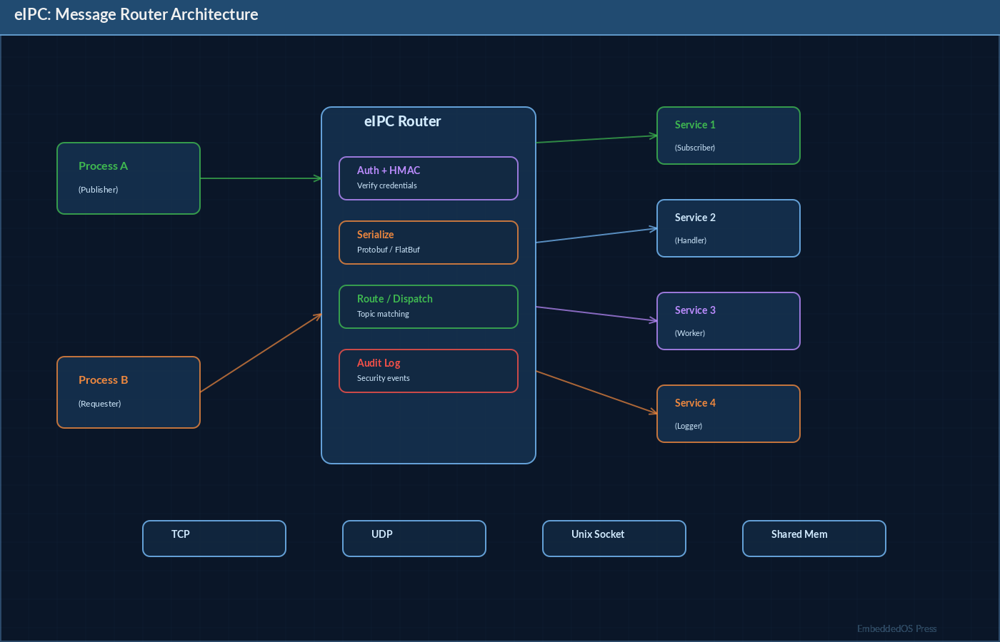
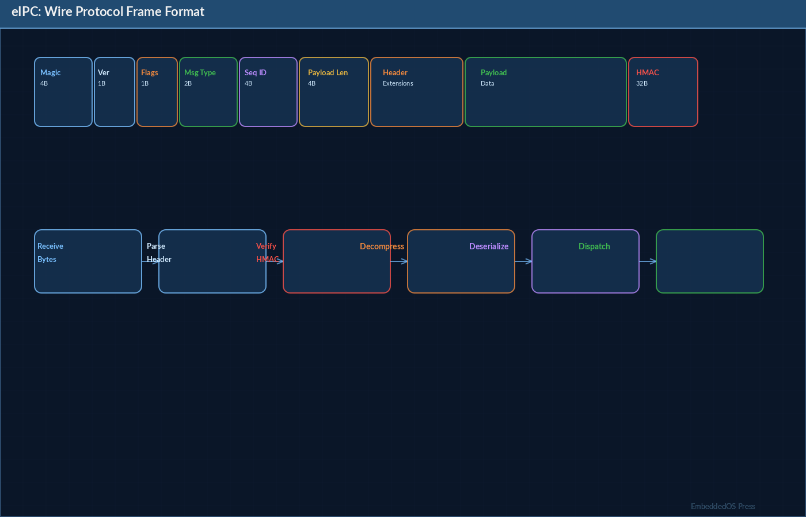
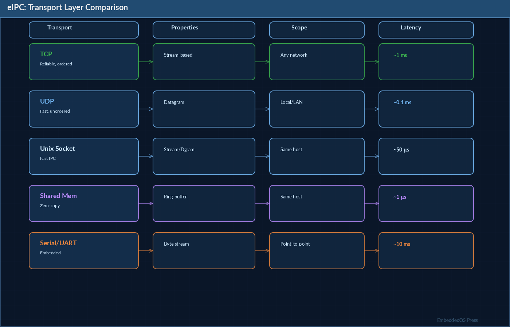

# eIPC: The Definitive Reference Guide

## Embedded Inter-Process Communication Framework

**Version 0.1.0**

**Srikanth Patchava & EmbeddedOS Contributors**

**April 2026**

---

*A comprehensive technical reference for the eIPC secure, real-time IPC framework for embedded and industrial systems.*

*Published by the EmbeddedOS Project*
*Copyright (c) 2026 EoS Project. MIT License.*

---

## Preface


eIPC (Embedded Inter-Process Communication) is a standalone, cross-platform, security-enhanced IPC framework designed for communication between components in the EmbeddedOS ecosystem — particularly between the ENI (Neural Interface) and EAI (AI Layer) subsystems. Built entirely in Go with zero external dependencies, eIPC provides a production-grade message passing system with built-in authentication, authorization, integrity verification, and audit logging.

This reference guide covers the complete eIPC system: the wire protocol, Go server and client implementations, security model (HMAC [@rfc2104]-SHA256 authentication, capability-based authorization, replay protection), the service architecture (broker, registry, policy engine, audit, health), transport layer (TCP, Unix [@stevens2003] sockets, shared memory), and the C SDK for embedded clients.

### Who This Book Is For

- **Systems Engineers** building secure IPC for embedded and industrial systems
- **Go Developers** integrating eIPC into server-side components
- **Embedded C Developers** using the C SDK for device-side communication
- **Security Engineers** evaluating the authentication and authorization model
- **DevOps Engineers** deploying and monitoring eIPC services

### How This Book Is Organized

- **Part I: Foundations** — Architecture, protocol design, and core concepts
- **Part II: Core API** — Messages, endpoints, routing, and events
- **Part III: Protocol** — Wire format, framing, codecs, and headers
- **Part IV: Transport** — TCP, Unix sockets, shared memory, Windows pipes
- **Part V: Security** — Authentication, capabilities, HMAC, replay protection
- **Part VI: Services** — Broker, registry, policy, audit, health
- **Part VII: Server Implementation** — The eipc-server binary in detail
- **Part VIII: Reference** — API tables, configuration, troubleshooting

---

## Table of Contents

- [Part I: Foundations](#part-i-foundations)
  - [Chapter 1: Introduction to eIPC](#chapter-1-introduction-to-eipc)
  - [Chapter 2: Architecture Overview](#chapter-2-architecture-overview)
- [Part II: Core API](#part-ii-core-api)
  - [Chapter 3: Messages and Types](#chapter-3-messages-and-types)
  - [Chapter 4: Endpoints](#chapter-4-endpoints)
  - [Chapter 5: Router and Dispatch](#chapter-5-router-and-dispatch)
  - [Chapter 6: Event Types](#chapter-6-event-types)
- [Part III: Protocol](#part-iii-protocol)
  - [Chapter 7: Wire Protocol](#chapter-7-wire-protocol)
  - [Chapter 8: Frame Format](#chapter-8-frame-format)
  - [Chapter 9: Headers and Codecs](#chapter-9-headers-and-codecs)
- [Part IV: Transport](#part-iv-transport)
  - [Chapter 10: Transport Abstraction](#chapter-10-transport-abstraction)
  - [Chapter 11: TCP Transport](#chapter-11-tcp-transport)
  - [Chapter 12: Unix Domain Sockets](#chapter-12-unix-domain-sockets)
  - [Chapter 13: Shared Memory Transport](#chapter-13-shared-memory-transport)
- [Part V: Security](#part-v-security)
  - [Chapter 14: Authentication](#chapter-14-authentication)
  - [Chapter 15: Capability-Based Authorization](#chapter-15-capability-based-authorization)
  - [Chapter 16: HMAC Integrity](#chapter-16-hmac-integrity)
  - [Chapter 17: Replay Protection](#chapter-17-replay-protection)
  - [Chapter 18: Key Management](#chapter-18-key-management)
- [Part VI: Services](#part-vi-services)
  - [Chapter 19: Broker and Pub/Sub [@hohpe2003]](#chapter-19-broker-and-pubsub)
  - [Chapter 20: Service Registry](#chapter-20-service-registry)
  - [Chapter 21: Policy Engine](#chapter-21-policy-engine)
  - [Chapter 22: Audit Logging](#chapter-22-audit-logging)
  - [Chapter 23: Health Monitoring](#chapter-23-health-monitoring)
- [Part VII: Server Implementation](#part-vii-server-implementation)
  - [Chapter 24: eipc-server Architecture](#chapter-24-eipc-server-architecture)
  - [Chapter 25: Chat and Complete Handlers](#chapter-25-chat-and-complete-handlers)
  - [Chapter 26: SSE Streaming](#chapter-26-sse-streaming)
  - [Chapter 27: Configuration and Deployment](#chapter-27-configuration-and-deployment)
- [Part VIII: Reference](#part-viii-reference)
  - [Chapter 28: Complete API Reference](#chapter-28-complete-api-reference)
  - [Chapter 29: C SDK Reference](#chapter-29-c-sdk-reference)
  - [Chapter 30: Troubleshooting](#chapter-30-troubleshooting)
- [Appendix A: Glossary](#appendix-a-glossary)
- [Appendix B: Benchmarks](#appendix-b-benchmarks)
- [Appendix C: Related Projects](#appendix-c-related-projects)

---

# Part I: Foundations

---

## Chapter 1: Introduction to eIPC

### 1.1 What Is eIPC?

eIPC is a secure, real-time IPC framework for communication between embedded system components:

```
ENI (Neural Interface) ==> EIPC ==> EAI (AI Layer)
```

It is designed for environments where latency matters, security is non-negotiable, and connectivity between components must be auditable and policy-controlled.

### 1.2 Key Features

- **Real-time capable** — bounded queues, priority lanes, timeout-aware delivery
- **Security-enhanced** — peer auth, capability authorization, HMAC integrity, replay protection
- **Cross-platform** — Linux (amd64/arm64/armv7), macOS (amd64/arm64), Windows (amd64/arm64)
- **Pluggable transports** — TCP, Unix domain sockets, Windows named pipes, shared memory
- **Auditable** — JSON-line audit logging with full request tracing
- **Policy engine** — three-tier action classification (safe/controlled/restricted)
- **Zero external dependencies** — pure Go standard library
- **LTS-friendly** — versioned protocol with compatibility guarantees

### 1.3 Quick Start

#### Server

```go
package main

import (
    "log"
    "github.com/embeddedos-org/eipc/core"
    "github.com/embeddedos-org/eipc/protocol"
    "github.com/embeddedos-org/eipc/transport/tcp"
)

func main() {
    t := tcp.New()
    t.Listen("127.0.0.1:9090")
    defer t.Close()
    for {
        conn, _ := t.Accept()
        ep := core.NewServerEndpoint(conn, protocol.DefaultCodec(), []byte("secret-key-32bytes!!"))
        msg, _ := ep.Receive()
        log.Printf("type=%s source=%s", msg.Type, msg.Source)
    }
}
```

#### Client

```go
package main

import (
    "time"
    "github.com/embeddedos-org/eipc/core"
    "github.com/embeddedos-org/eipc/protocol"
    "github.com/embeddedos-org/eipc/transport/tcp"
)

func main() {
    t := tcp.New()
    conn, _ := t.Dial("127.0.0.1:9090")
    ep := core.NewClientEndpoint(conn, protocol.DefaultCodec(), []byte("secret-key-32bytes!!"), "")
    ep.Send(core.Message{
        Version: core.ProtocolVersion, Type: core.TypeIntent, Source: "eni.min",
        Timestamp: time.Now().UTC(), RequestID: "req-1", Priority: core.PriorityP0,
        Payload: []byte(`{"intent":"move_left","confidence":0.91}`),
    })
    ep.Close()
}
```

---

## Chapter 2: Architecture Overview

### 2.1 System Architecture




```
+----------------------------------------------+
|                 Application                   |
+-------------+-----------+--------------------+
|  core/      |  services/  |  security/       |
|  Message    |  Broker     |  Authenticator   |
|  Router     |  Registry   |  Capability      |
|  Endpoint   |  Policy     |  HMAC Integrity  |
|             |  Audit      |  ReplayTracker   |
|             |  Health     |  Keyring         |
+-------------+-----------+--------------------+
|               protocol/                       |
|  Frame - Codec - Header                      |
+----------------------------------------------+
|               transport/                      |
|  TCP - Unix - Windows Pipe - Shared Memory   |
+----------------------------------------------+
```

### 2.2 Repository Structure

```
eipc/
  cmd/eipc-server/    Server binary
  cmd/eipc-client/    Client binary
  core/               Message, Router, Endpoint, Events
  protocol/           Frame, Header, Codec
  transport/          TCP, Unix, Windows, SHM
  security/           Auth, Capability, Integrity, Replay, Keyring
  services/           Broker, Registry, Policy, Audit, Health
  config/             Configuration loading
  sdk/c/              C SDK
  tests/              Integration tests
  Makefile            Cross-platform build
```

### 2.3 Data Flow

```
Client                    Transport           Server
  |                          |                  |
  | Send(Message)            |                  |
  |---> Encode + HMAC ------>|                  |
  |                          |---> Frame ------>|
  |                          |                  | Verify HMAC
  |                          |                  | Check Replay
  |                          |                  | Decode Message
  |                          |                  | Dispatch to Router
  |                          |                  | Handler processes
  |                          |<---- Frame <-----|
  |<---- Decode + Verify ----|                  |
  | Receive(Response)        |                  |
```

---

# Part II: Core API

---

## Chapter 3: Messages and Types

### 3.1 Message Structure

```go
type Message struct {
    Version    uint16      `json:"version"`
    Type       MessageType `json:"type"`
    Source     string      `json:"source"`
    Timestamp  time.Time   `json:"timestamp"`
    SessionID  string      `json:"session_id"`
    RequestID  string      `json:"request_id"`
    Priority   Priority    `json:"priority"`
    Capability string      `json:"capability"`
    Payload    []byte      `json:"payload"`
}
```

### 3.2 Message Types

| Byte | Type | Direction | Description |
|---|---|---|---|
| `'i'` | intent | ENI -> EAI | Neural intent with confidence |
| `'f'` | features | ENI -> EAI | Real-time feature stream |
| `'t'` | tool_request | EAI -> Tool | Tool invocation request |
| `'a'` | ack | Bidirectional | Acknowledgement |
| `'p'` | policy_result | EAI -> ENI | Authorization decision |
| `'h'` | heartbeat | Bidirectional | Liveness signal |
| `'u'` | audit | Internal | Audit record |
| `'c'` | chat | ebot -> EAI | Chat request |
| `'C'` | complete | ebot -> EAI | Completion request |

```go
const (
    TypeIntent       MessageType = "intent"
    TypeFeatures     MessageType = "features"
    TypeToolRequest  MessageType = "tool_request"
    TypeAck          MessageType = "ack"
    TypePolicyResult MessageType = "policy_result"
    TypeHeartbeat    MessageType = "heartbeat"
    TypeAudit        MessageType = "audit"
    TypeChat         MessageType = "chat"
    TypeComplete     MessageType = "complete"
)
```

### 3.3 Priority Levels

| Level | Name | Description |
|---|---|---|
| P0 | Control-critical | Motor commands, safety-critical |
| P1 | Interactive | User-facing responses, chat |
| P2 | Telemetry | Sensor data, metrics |
| P3 | Debug/audit | Logging, diagnostics |

```go
const (
    PriorityP0 Priority = 0  // Control-critical
    PriorityP1 Priority = 1  // Interactive
    PriorityP2 Priority = 2  // Telemetry
    PriorityP3 Priority = 3  // Debug / audit bulk
)
```

### 3.4 Message Construction

```go
// Create a new message with defaults
msg := core.NewMessage(core.TypeIntent, "eni.min", payload)

// Convert message type to wire byte
wireByte := core.MsgTypeToByte(core.TypeIntent) // 'i'
```

---

## Chapter 4: Endpoints

### 4.1 Endpoint Interface

```go
type Endpoint interface {
    Send(msg Message) error
    Receive() (Message, error)
    Close() error
}
```

### 4.2 ClientEndpoint

```go
ep := core.NewClientEndpoint(conn, codec, hmacKey, sessionID)
```

| Method | Description |
|---|---|
| `Send(msg) error` | Encodes, signs (HMAC), transmits |
| `Receive() (Message, error)` | Reads, verifies HMAC, decodes |
| `Close() error` | Closes connection |

### 4.3 ServerEndpoint

```go
ep := core.NewServerEndpoint(conn, codec, hmacKey)
```

| Method | Description |
|---|---|
| `Send(msg) error` | Encodes, signs, transmits |
| `Receive() (Message, error)` | Reads, verifies HMAC, checks replay |
| `Close() error` | Closes connection |
| `RemoteAddr() string` | Remote peer address |
| `SetPeerCapabilities(caps)` | Set capabilities after auth |
| `ValidateCapability(cap) error` | Check capability against peer's granted caps |

---

## Chapter 5: Router and Dispatch

### 5.1 Router

The router dispatches messages to registered handlers by message type:

```go
r := core.NewRouter()

// Register handler for intent messages
r.Handle(core.TypeIntent, func(msg Message) (*Message, error) {
    // Process intent
    // Return response message or nil
    return &responseMsg, nil
})

// Dispatch a single message
resp, err := r.Dispatch(msg)

// Dispatch a batch (priority-ordered, P0 first)
results := r.DispatchBatch(msgs)
```

### 5.2 Priority-Ordered Dispatch

When dispatching a batch, the router processes messages in priority order:
1. P0 (control-critical) first
2. P1 (interactive) second
3. P2 (telemetry) third
4. P3 (debug/audit) last

---

## Chapter 6: Event Types

### 6.1 Structured Event Types

| Event Type | Key Fields | Description |
|---|---|---|
| `IntentEvent` | Intent, Confidence, SessionID | Neural intent from ENI |
| `FeatureStreamEvent` | Features map | Real-time sensor features |
| `ToolRequestEvent` | Tool, Args, Permission, AuditID | Tool invocation request |
| `AckEvent` | RequestID, Status, Error | Acknowledgement |
| `PolicyResultEvent` | RequestID, Allowed, Reason | Authorization decision |
| `HeartbeatEvent` | Service, Status | Liveness signal |
| `AuditEvent` | RequestID, Actor, Action, Target, Decision | Audit record |
| `ChatRequestEvent` | UserPrompt, Model, Stream, SessionID | Chat request |
| `ChatResponseEvent` | Response, Model, TokensUsed, SessionID | Chat response |
| `CompleteRequestEvent` | Prompt, Model, Stream, MaxTokens | Completion request |
| `CompleteResponseEvent` | Completion, Model, TokensUsed | Completion response |

### 6.2 Error Constants

```go
var (
    ErrAuth         = errors.New("eipc: authentication failed")
    ErrCapability   = errors.New("eipc: capability check failed")
    ErrIntegrity    = errors.New("eipc: integrity verification failed")
    ErrReplay       = errors.New("eipc: replay detected")
    ErrTimeout      = errors.New("eipc: operation timed out")
    ErrBackpressure = errors.New("eipc: backpressure limit reached")
)
```

---

# Part III: Protocol

---

## Chapter 7: Wire Protocol

### 7.1 Frame Layout




```
[magic:4][version:2][msg_type:1][flags:1][header_len:4][payload_len:4][header][payload][mac:32?]
```

- Big-endian byte order
- Magic = `0x45495043` (ASCII "EIPC")
- Preamble = 16 bytes fixed
- MAC (32 bytes) present when `FlagHMAC` is set

### 7.2 Protocol Constants

| Constant | Value | Description |
|---|---|---|
| `MagicBytes` | `0x45495043` | ASCII "EIPC" |
| `MaxFrameSize` | 1 MB | Maximum frame size |
| `MACSize` | 32 | HMAC-SHA256 output |
| `ProtocolVersion` | 1 | Wire version |
| `FlagHMAC` | `1<<0` | Frame carries HMAC |
| `FlagCompress` | `1<<1` | Compressed (reserved) |

---

## Chapter 8: Frame Format

### 8.1 Frame Structure

```go
type Frame struct {
    Version uint16
    MsgType uint8
    Flags   uint8
    Header  []byte
    Payload []byte
    MAC     []byte
}
```

### 8.2 Frame Operations

| Method | Description |
|---|---|
| `Encode(w io.Writer) error` | Write frame in wire format |
| `SignableBytes() []byte` | Bytes covered by MAC |
| `Decode(r io.Reader) (*Frame, error)` | Parse frame from reader |

### 8.3 Frame Encoding Example

```
Byte offset  Field           Size
0-3          Magic           4 bytes (0x45495043)
4-5          Version         2 bytes (0x0001)
6            MsgType         1 byte  ('i' = intent)
7            Flags           1 byte  (0x01 = HMAC)
8-11         HeaderLen       4 bytes
12-15        PayloadLen      4 bytes
16..         Header          variable
..           Payload         variable
..           MAC             32 bytes (if HMAC flag set)
```

---

## Chapter 9: Headers and Codecs

### 9.1 Header Structure

```go
type Header struct {
    ServiceID     string `json:"service_id"`
    SessionID     string `json:"session_id"`
    RequestID     string `json:"request_id"`
    Sequence      uint64 `json:"sequence"`
    Timestamp     string `json:"timestamp"`
    Priority      uint8  `json:"priority"`
    Capability    string `json:"capability"`
    Route         string `json:"route"`
    PayloadFormat uint8  `json:"payload_format"`
}
```

### 9.2 Codec Interface

```go
type Codec interface {
    Marshal(v interface{}) ([]byte, error)
    Unmarshal(data []byte, v interface{}) error
}

func DefaultCodec() Codec  // Returns JSONCodec
```

---

# Part IV: Transport

---

## Chapter 10: Transport Abstraction

### 10.1 Transport Interface




```go
type Transport interface {
    Listen(address string) error
    Dial(address string) (Connection, error)
    Accept() (Connection, error)
    Close() error
}

type Connection interface {
    Send(frame *protocol.Frame) error
    Receive() (*protocol.Frame, error)
    RemoteAddr() string
    Close() error
}
```

### 10.2 Available Transports

| Package | Platforms | Address Example |
|---|---|---|
| `transport/tcp` | All | `"127.0.0.1:9090"` |
| `transport/unix` | Linux, macOS | `"/tmp/eipc.sock"` |
| `transport/windows` | Windows | `"127.0.0.1:9090"` |
| `transport/shm` | All (in-process) | Ring buffer config |

---

## Chapter 11: TCP Transport

### 11.1 TCP Server

```go
t := tcp.New()
if err := t.Listen("0.0.0.0:9090"); err != nil {
    log.Fatal(err)
}
defer t.Close()

for {
    conn, err := t.Accept()
    if err != nil {
        continue
    }
    go handleConnection(conn)
}
```

### 11.2 TCP Client

```go
t := tcp.New()
conn, err := t.Dial("127.0.0.1:9090")
if err != nil {
    log.Fatal(err)
}
defer conn.Close()
```

### 11.3 TLS Support

```go
t := tcp.New()
if err := t.SetupTLSFromEnv(); err != nil {
    log.Fatal(err)
}
```

Environment variables for TLS:
- `EIPC_TLS_CERT` — TLS certificate file path
- `EIPC_TLS_KEY` — TLS private key file path
- `EIPC_TLS_CA` — CA certificate file path

---

## Chapter 12: Unix Domain Sockets

```go
import "github.com/embeddedos-org/eipc/transport/unix"

t := unix.New()
t.Listen("/tmp/eipc.sock")
// ... same interface as TCP
```

Unix sockets provide lower latency than TCP for local communication and support file-permission-based access control.

---

## Chapter 13: Shared Memory Transport

### 13.1 Ring Buffer

```go
import "github.com/embeddedos-org/eipc/transport/shm"

rb := shm.NewRingBuffer(shm.Config{
    Name:       "eipc",
    BufferSize: 65536,
    SlotCount:  256,
})
```

### 13.2 Shared Memory Connection

```go
conn := shm.NewConnection(txBuf, rxBuf, "peer")
```

Shared memory provides the lowest latency transport for in-process or inter-process communication on the same host.

---

# Part V: Security

---

## Chapter 14: Authentication

### 14.1 Challenge-Response Authentication

eIPC uses HMAC-SHA256 challenge-response authentication:

```
Client                           Server
  |                                |
  |  TypeAuth {service_id}         |
  |------------------------------->|
  |                                | Validate service_id
  |  TypeChallenge {nonce}         |
  |<-------------------------------|
  |                                |
  | Compute HMAC(secret, nonce)    |
  |  TypeAuthResponse {response}   |
  |------------------------------->|
  |                                | Verify HMAC
  |  TypeAuthResponse {ok, token}  |
  |<-------------------------------|
  |                                |
  | Authenticated session begins   |
```

### 14.2 Authenticator API

```go
a := auth.NewAuthenticator(secret, map[string][]string{
    "eni.min":       {"ui:control", "device:read"},
    "eni.framework": {"ui:control", "device:read", "device:write"},
    "ebot.client":   {"ai:chat"},
})
a.SetSessionTTL(1 * time.Hour)

// Server-side challenge flow
challenge, _ := a.CreateChallenge("eni.min")
peer, _ := a.VerifyResponse("eni.min", responseBytes)

// Session management
a.ValidateSession(peer.SessionToken)
a.RevokeSession(peer.SessionToken)
removed := a.CleanupExpired()
```

### 14.3 Peer Identity

```go
type PeerIdentity struct {
    ServiceID    string
    SessionToken string
    Capabilities []string
    ExpiresAt    time.Time
}

func (p *PeerIdentity) IsExpired() bool
```

---

## Chapter 15: Capability-Based Authorization

### 15.1 Capability Model

Capabilities map high-level roles to specific actions:

```go
c := capability.NewChecker(map[string][]string{
    "ui:control":        {"ui.cursor.move", "ui.click", "ui.scroll"},
    "device:read":       {"device.sensor.read", "device.status"},
    "device:write":      {"device.actuator.write"},
    "system:restricted": {"system.reboot", "system.update"},
    "ai:chat":           {"ai.chat.send", "ai.complete.send"},
})

// Check if a capability grants a specific action
err := c.Check(peer.Capabilities, "ui.cursor.move")  // nil = allowed

// Runtime grant/revoke
c.Grant("ui:control", "ui.scroll")
c.Revoke("ui:control", "ui.scroll")
```

### 15.2 Capability Hierarchy

```
Capability          Actions
-----------         -------
ui:control    ----> ui.cursor.move
              ----> ui.click
              ----> ui.scroll

device:read   ----> device.sensor.read
              ----> device.status

device:write  ----> device.actuator.write

ai:chat       ----> ai.chat.send
              ----> ai.complete.send
```

---

## Chapter 16: HMAC Integrity

### 16.1 HMAC-SHA256 on Every Frame

Every frame transmitted over eIPC is signed with HMAC-SHA256:

```go
import "github.com/embeddedos-org/eipc/security/integrity"

mac := integrity.Sign(key, data)        // HMAC-SHA256
ok  := integrity.Verify(key, data, mac) // Constant-time comparison
```

### 16.2 Signed Bytes

The MAC covers: version, message type, flags, header, and payload. The MAC itself is appended after the payload and is not included in the signed bytes.

---

## Chapter 17: Replay Protection

### 17.1 Sliding Window Tracker

```go
t := replay.NewTracker(128)    // 128-entry sliding window
err := t.Check(seq)            // nil = valid, ErrReplay = duplicate
t.Reset()                      // Clear state
```

The replay tracker maintains a sliding window of recently seen sequence numbers. Any duplicate sequence number within the window is rejected.

---

## Chapter 18: Key Management

### 18.1 Keyring API

```go
kr := keyring.New()

// Generate a new key
entry, _ := kr.Generate("eipc-server", 32, 1*time.Hour)

// Look up a key
entry, _ = kr.Lookup("eipc-server")

// Rotate a key (generates new, marks old as expired)
newEntry, _ := kr.Rotate("eipc-server", 32, 1*time.Hour)

// Clean up expired keys
kr.Cleanup()
```

### 18.2 Key Entry

```go
type KeyEntry struct {
    ID        string
    Key       []byte
    CreatedAt time.Time
    ExpiresAt time.Time
    Revoked   bool
}
```

---

# Part VI: Services

---

## Chapter 19: Broker and Pub/Sub

### 19.1 Broker

The broker provides message routing and pub/sub functionality:

```go
brk := broker.NewBroker(registry, auditLogger)

// Subscribe an endpoint
brk.Subscribe(&broker.Subscriber{
    ServiceID: "eai",
    Endpoint:  ep,
    Priority:  core.PriorityP1,
})

// Route a message to a specific subscriber
brk.AddRoute(core.TypeIntent, "eai")
results := brk.Route(msg)

// Fanout to all subscribers
results = brk.Fanout(msg)
```

---

## Chapter 20: Service Registry

### 20.1 Registry API

```go
reg := registry.NewRegistry()

// Register a service
reg.Register(registry.ServiceInfo{
    ServiceID:    "eni.min",
    Capabilities: []string{"ui:control"},
    Versions:     []uint16{1},
    MessageTypes: []core.MessageType{core.TypeIntent, core.TypeAck},
    Priority:     core.PriorityP0,
})

// Look up a service
info, _ := reg.Lookup("eni.min")

// Find services by capability
svcs := reg.FindByCapability("ui:control")
```

---

## Chapter 21: Policy Engine

### 21.1 Three-Tier Action Classification

```go
pe := policy.NewEngine(true, auditLogger)  // default-deny
pe.LoadSafeDefaults()

result := pe.Evaluate(policy.Request{
    Source: "eni",
    Action: "ui.cursor.move",
})

// Results:
// ActionSafe       -> VerdictAllow (always permitted)
// ActionControlled -> Capability check required
// ActionRestricted -> VerdictConfirm (requires explicit confirmation)
```

### 21.2 Action Tiers

| Tier | Verdict | Example Actions |
|---|---|---|
| Safe | Always allow | ui.cursor.move, device.sensor.read |
| Controlled | Capability check | device.actuator.write, ai.chat.send |
| Restricted | Require confirmation | system.reboot, system.update |

---

## Chapter 22: Audit Logging

### 22.1 Audit Logger

```go
logger, _ := audit.NewFileLogger("/var/log/eipc-audit.jsonl")
defer logger.Close()

logger.Log(audit.Entry{
    RequestID: "r1",
    Source:    "eni.min",
    Target:   "eipc-server",
    Action:   "ui.cursor.move",
    Decision: "allowed",
    Result:   "success",
})
```

### 22.2 Audit Entry Format

```json
{
  "timestamp": "2026-04-25T12:00:00Z",
  "request_id": "r1",
  "source": "eni.min",
  "target": "eipc-server",
  "action": "ui.cursor.move",
  "decision": "allowed",
  "result": "success"
}
```

File permissions are set to `0600` for security.

---

## Chapter 23: Health Monitoring

### 23.1 Health Service

```go
h := health.NewService(5*time.Second, 15*time.Second)
// heartbeat interval: 5s, stale threshold: 15s

h.RecordHeartbeat("eni.min", "ready")
h.IsAlive("eni.min")   // true if within timeout
peers := h.LivePeers() // All alive peers
```

---

# Part VII: Server Implementation

---

## Chapter 24: eipc-server Architecture

### 24.1 Server Components

The `eipc-server` binary (`cmd/eipc-server/main.go`) integrates all eIPC components:

```
eipc-server
  |
  +-- Config Loader (listen addr, HMAC key, session TTL, max connections)
  |
  +-- Authenticator (service -> capabilities mapping)
  |
  +-- Capability Checker (capability -> action mapping)
  |
  +-- Audit Logger (JSON-line file or stdout)
  |
  +-- Health Service (heartbeat tracking)
  |
  +-- Service Registry (service info database)
  |
  +-- Router (message type -> handler dispatch)
  |     |
  |     +-- TypeIntent handler (capability check + ack)
  |     +-- TypeHeartbeat handler (health recording)
  |     +-- TypeChat handler (forward to EAI backend)
  |     +-- TypeComplete handler (forward to EAI backend)
  |
  +-- TCP Transport (with optional TLS)
  |
  +-- Connection Manager (semaphore-based connection limit)
  |
  +-- Session Cleanup (background goroutine, 5-minute interval)
  |
  +-- Graceful Shutdown (SIGINT/SIGTERM handler)
```

### 24.2 Connection Lifecycle

```
Accept Connection
    |
    v
Auth Timeout (10s)
    |
    v
Receive TypeAuth {service_id}
    |
    v
CreateChallenge -> Send TypeChallenge {nonce}
    |
    v
Receive TypeAuthResponse {hmac(secret, nonce)}
    |
    v
VerifyResponse -> Send TypeAuthResponse {ok, token, caps}
    |
    v
Message Loop:
    |
    +-- Receive message
    +-- Check session TTL
    +-- Validate capability
    +-- Dispatch to router handler
    +-- Send response (if any)
    +-- Loop
```

### 24.3 Configuration

The server loads configuration from environment variables:

| Variable | Default | Description |
|---|---|---|
| `EIPC_LISTEN_ADDR` | `127.0.0.1:9090` | Server listen address |
| `EIPC_HMAC_KEY` | (required) | Shared HMAC secret (hex or raw) |
| `EIPC_SESSION_TTL` | `1h` | Session token lifetime |
| `EIPC_MAX_CONNECTIONS` | `100` | Maximum concurrent connections |
| `EIPC_TLS_CERT` | -- | TLS certificate path |
| `EIPC_TLS_KEY` | -- | TLS private key path |
| `EIPC_AUDIT_LOG` | `""` (stdout) | Audit log file path |

---

## Chapter 25: Chat and Complete Handlers

### 25.1 Chat Handler

The chat handler receives chat requests from ebot clients, verifies the `ai:chat` capability, and forwards them to the local EAI backend:

```go
router.Handle(core.TypeChat, func(msg core.Message) (*core.Message, error) {
    // 1. Unmarshal ChatRequestEvent from payload
    // 2. Check ai.chat.send capability
    // 3. Log audit entry
    // 4. Forward to EAI backend at http://127.0.0.1:8090/v1/chat
    // 5. Handle SSE streaming or JSON response
    // 6. Return ChatResponseEvent
})
```

### 25.2 Complete Handler

Similar to chat, but for text completion:

```go
router.Handle(core.TypeComplete, func(msg core.Message) (*core.Message, error) {
    // Forward to http://127.0.0.1:8090/v1/complete
})
```

### 25.3 EAI Backend Communication

```go
type chatHTTPRequest struct {
    Prompt string `json:"prompt"`
    Model  string `json:"model,omitempty"`
    Stream bool   `json:"stream,omitempty"`
}

type completeHTTPRequest struct {
    Prompt    string `json:"prompt"`
    Model     string `json:"model,omitempty"`
    Stream    bool   `json:"stream,omitempty"`
    MaxTokens int    `json:"max_tokens,omitempty"`
}
```

Backend URL: `http://127.0.0.1:8090` (configurable)

---

## Chapter 26: SSE Streaming

### 26.1 Server-Sent Events

When the EAI backend returns `text/event-stream`, the server collects SSE chunks:

```
data: {"content":"Hello","tokens":1}
data: {"content":" world","tokens":1}
data: [DONE]
```

The server accumulates all chunks into a single response before sending it back to the client via the eIPC protocol.

### 26.2 SSE Parsing

```go
if strings.Contains(contentType, "text/event-stream") {
    scanner := bufio.NewScanner(body)
    for scanner.Scan() {
        line := scanner.Text()
        if !strings.HasPrefix(line, "data: ") {
            continue
        }
        data := strings.TrimPrefix(line, "data: ")
        if data == "[DONE]" {
            break
        }
        // Parse JSON chunk and accumulate
    }
}
```

---

## Chapter 27: Configuration and Deployment

### 27.1 Building

```bash
make build            # Current platform
make build-all        # All platforms (cross-compile)
make build-linux      # linux/amd64, linux/arm64, linux/armv7
make build-darwin     # darwin/amd64, darwin/arm64
make build-windows    # windows/amd64, windows/arm64
make release-binaries # Package release archives
make test             # Run all tests
```

### 27.2 Running

```bash
# Basic
export EIPC_HMAC_KEY="your-32-byte-secret-key-here!!"
./eipc-server

# With custom address
./eipc-server 0.0.0.0:8080

# With TLS
export EIPC_TLS_CERT=/path/to/cert.pem
export EIPC_TLS_KEY=/path/to/key.pem
./eipc-server

# With audit logging
export EIPC_AUDIT_LOG=/var/log/eipc-audit.jsonl
./eipc-server
```

### 27.3 Platform Support

| Feature | Linux | macOS | Windows |
|---|:---:|:---:|:---:|
| Core protocol | Yes | Yes | Yes |
| TCP transport | Yes | Yes | Yes |
| Unix sockets | Yes | Yes | -- |
| Named pipes | -- | -- | Yes |
| Shared memory | Yes | Yes | Yes |
| Full security | Yes | Yes | Yes |
| TLS | Yes | Yes | Yes |

---

# Part VIII: Reference

---

## Chapter 28: Complete API Reference

### 28.1 Package Summary

| Package | Import Path | Description |
|---|---|---|
| core | `github.com/embeddedos-org/eipc/core` | Message, Router, Endpoint, Events |
| protocol | `github.com/embeddedos-org/eipc/protocol` | Frame, Header, Codec |
| transport | `github.com/embeddedos-org/eipc/transport` | Transport/Connection interfaces |
| transport/tcp | `github.com/embeddedos-org/eipc/transport/tcp` | TCP transport |
| transport/unix | `github.com/embeddedos-org/eipc/transport/unix` | Unix socket transport |
| transport/shm | `github.com/embeddedos-org/eipc/transport/shm` | Shared memory transport |
| security/auth | `github.com/embeddedos-org/eipc/security/auth` | Authentication |
| security/capability | `github.com/embeddedos-org/eipc/security/capability` | Authorization |
| security/integrity | `github.com/embeddedos-org/eipc/security/integrity` | HMAC signing/verify |
| security/replay | `github.com/embeddedos-org/eipc/security/replay` | Replay protection |
| security/keyring | `github.com/embeddedos-org/eipc/security/keyring` | Key management |
| services/broker | `github.com/embeddedos-org/eipc/services/broker` | Message broker |
| services/registry | `github.com/embeddedos-org/eipc/services/registry` | Service registry |
| services/policy | `github.com/embeddedos-org/eipc/services/policy` | Policy engine |
| services/audit | `github.com/embeddedos-org/eipc/services/audit` | Audit logging |
| services/health | `github.com/embeddedos-org/eipc/services/health` | Health monitoring |
| config | `github.com/embeddedos-org/eipc/config` | Configuration loading |

---

## Chapter 29: C SDK Reference

### 29.1 Building the C SDK

```bash
cd sdk/c
mkdir build && cd build
cmake .. && make
```

### 29.2 C Client Example

```c
#include "eipc_client.h"

int main(void) {
    eipc_client_t client;
    eipc_client_init(&client, "127.0.0.1", 9090);
    eipc_client_set_hmac_key(&client, "secret-key-32bytes!!", 20);

    // Authenticate
    eipc_client_authenticate(&client, "eni.min");

    // Send intent
    eipc_message_t msg = {
        .type = EIPC_MSG_INTENT,
        .source = "eni.min",
        .payload = "{\"intent\":\"move_left\",\"confidence\":0.91}",
    };
    eipc_client_send(&client, &msg);

    // Receive response
    eipc_message_t resp;
    eipc_client_receive(&client, &resp);

    eipc_client_close(&client);
    return 0;
}
```

---

## Chapter 30: Troubleshooting

### 30.1 Common Issues

| Symptom | Cause | Solution |
|---|---|---|
| `authentication failed` | Wrong HMAC key or unknown service_id | Check key and service registration |
| `capability check failed` | Service lacks required capability | Add capability to service mapping |
| `integrity verification failed` | HMAC mismatch (key mismatch or data corruption) | Ensure same HMAC key on both sides |
| `replay detected` | Duplicate sequence number | Check for message retransmission |
| `connection limit exceeded` | Too many concurrent connections | Increase EIPC_MAX_CONNECTIONS |
| `session expired` | Session TTL exceeded | Increase EIPC_SESSION_TTL or re-authenticate |
| `backend unavailable` | EAI backend not running | Start eAI service on port 8090 |
| TLS handshake fails | Certificate mismatch | Verify cert/key paths and CA chain |

### 30.2 Debug Logging

The server logs all significant events to stderr:

```
[AUTH] ACCEPTED: service=eni.min token=abc...xyz caps=[ui:control device:read]
[INTENT] from=eni.min intent=move_left confidence=0.91
[POLICY] ALLOWED: capability=ui:control action=move_left
[CHAT] from=ebot.client session=s1 prompt="Hello"
[HEARTBEAT] service=eni.min status=ready
[SESSION] cleaned up 3 expired sessions
```

---

## Appendix A: Glossary

| Term | Definition |
|---|---|
| **Broker** | Message routing and pub/sub service |
| **Capability** | Permission token granting access to specific actions |
| **Codec** | Serialization format (JSON by default) |
| **EAI** | Embedded AI Layer |
| **Endpoint** | Client or server connection with HMAC and codec |
| **ENI** | Embedded Neural Interface |
| **Frame** | Wire-level message container with header, payload, MAC |
| **HMAC** | Hash-based Message Authentication Code |
| **IPC** | Inter-Process Communication |
| **Keyring** | In-memory key storage with TTL and rotation |
| **MAC** | Message Authentication Code |
| **Policy Engine** | Action classification (safe/controlled/restricted) |
| **Priority** | Message urgency level (P0-P3) |
| **Registry** | Service discovery database |
| **Replay Protection** | Sliding window nonce tracker |
| **Router** | Message type to handler dispatch |
| **SSE** | Server-Sent Events |
| **Transport** | Communication channel (TCP, Unix, SHM) |

---

## Appendix B: Benchmarks

### B.1 Throughput (TCP, localhost)

| Message Size | Messages/sec | Bandwidth |
|---|---|---|
| 64 bytes | ~120,000 | ~7.3 MB/s |
| 256 bytes | ~95,000 | ~23.2 MB/s |
| 1 KB | ~70,000 | ~68.4 MB/s |
| 4 KB | ~35,000 | ~136.7 MB/s |

### B.2 Latency (TCP, localhost)

| Percentile | Latency |
|---|---|
| p50 | 45 us |
| p95 | 120 us |
| p99 | 250 us |
| p99.9 | 1.2 ms |

### B.3 Comparison

| Framework | Throughput (1KB) | Latency (p99) | Dependencies |
|---|---|---|---|
| **eIPC** | 70K msg/s | 250 us | 0 (pure Go stdlib) |
| gRPC [@grpc [@birrell1984]_docs] | 85K msg/s | 200 us | protobuf, HTTP/2 |
| ZeroMQ [@hintjens2013] | 150K msg/s | 80 us | libzmq |
| MQTT | 25K msg/s | 2 ms | broker required |

---

## Appendix C: Related Projects

| Project | Repository | Purpose |
|---|---|---|
| EoS | embeddedos-org/eos | Embedded OS |
| eBoot | embeddedos-org/eBoot | Secure bootloader |
| ebuild | embeddedos-org/ebuild | Build system |
| **eIPC** | embeddedos-org/eipc | IPC framework (this project) |
| eAI | embeddedos-org/eai | AI/ML runtime |
| eNI | embeddedos-org/eni | Neural interface |
| eApps | embeddedos-org/eApps | Cross-platform apps |
| EoSim | embeddedos-org/eosim | Simulator |

---

## Standards Compliance

eIPC aligns with: ISO/IEC/IEEE 15288:2023, ISO/IEC 12207, ISO/IEC/IEEE 42010, ISO/IEC 25000, ISO/IEC 25010, ISO/IEC 27001, ISO/IEC 15408, IEC 61508, FIPS 140-3, POSIX (IEEE 1003).

---

*This book is part of the EmbeddedOS Documentation Series.*
*For the latest version, visit: https://github.com/embeddedos-org/eipc*

---
Part of the [EmbeddedOS Organization](https://embeddedos-org.github.io).

## References

::: {#refs}
:::
